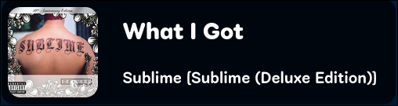
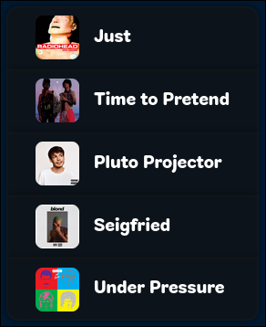
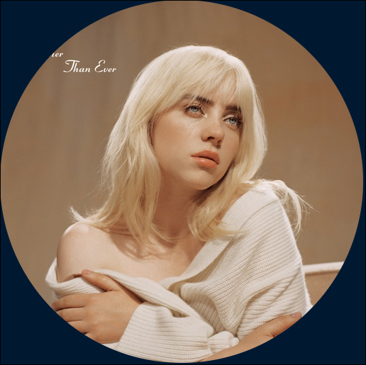
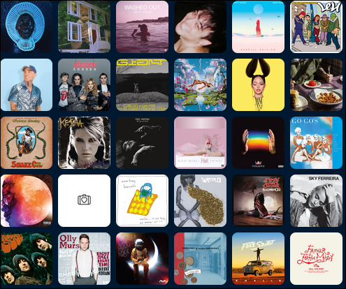

The repository name has lost the plot.

[Documentation](https://docs.ducky.wiki/projects/ducky_radio)

BASE URL: http://localhost:1234

### API URLS `/api`
- GET /tracks/nowplaying - Current playing Track
- GET /tracks/history - All previously played tracks (tracks.json)

### Service URLs `/api/service`
- GET /:service/nowplaying - Raw song data for a certain platform (cider, lastfm, icecast)

## Overlays `/overlay`

### `/nowplaying` W 800px x H 175px
> Display a card that shows the current track's title, artist, album, and cover art (if available)

> **URL Options**
> - "left" | "right" | none - Defaults to middle, defines flex alignment for the overlay page content
> - "inline" - Include to use the inline (text-based) overlay (W ≥1000px x H 75px)

### `/history` W ≤800px x H <>px
> Display a list of previously played tracks
>
> Shows last 5 played tracks by default

> **URL Options**
> - limit=number - How many tracks will be listed (defaults to 5)

### `/art/cover`
> Display the current track's cover art (if available)

> **URL Options**
> - "small" | "medium" | "large" - Defaults to medium, defines size in px of the cover image
>     - small - 128px x 128px
>     - medium - 512px x 512px
>     - large - 1024px x 1024px
> - radius=number | "circle" - The border radius of the image in pixels ("circle" for a circle) Defaults to 0px (square)
> - spin=0 | 1 - The direction in which the cover art will spin (0 - Counter Clockwise | 1 - Clockwise) (exclude for a static image)

### `/art/cover/grid`
> Display a grid of a specified number of previously played tracks (if art is available)
>
> Defaults to 5x6 (30 tracks)

> **URL Options**
> - radius=number | "circle" - The border radius of each individual image in pixels ("circle" for circles) Defaults to 0px (squares)
> - cols=number - The number of columns to display (defaults to 5)
> - limit=number - The maximum number of tracks to display (defaults to 30)

### `/art/cover/vinyl` W 610px x H 610px
> Display a spinning vinyl record displaying the current track's cover art
>
> A "loading" in/out animation will play on track change

 
> **URL Options**
> - spin=0 | 1 - The direction in which the vinyl will spin (0 - Counter Clockwise | 1 - Clockwise) (defaults to Clockwise)
